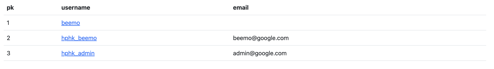

## 목표

Django Auth를 활용한 회원가입이 가능한 서비스를 개발합니다.

## 요구사항

### 모델 Model

- 모델 이름 : User

  Django **AbstractUser** 모델 상속

### **폼 Form**

- Django 내장 회원가입 폼 UserCreationForm을 상속받은 CustomUserCreationForm 생성 후 활용

  해당 폼은 아래 필드만 출력합니다.

  - username
  - email
  - password1
  - password2

### 기능 View

회원가입 Create

- `POST` http://127.0.0.1:8000/accounts/signup/
- CustomUserCreationForm을 활용해서 회원가입 구현

회원 목록 조회 Read(index)

- `GET` http://127.0.0.1:8000/accounts/

회원 정보 조회 Read(detail)

- `GET` http://127.0.0.1:8000/accounts/<user_pk>/

### 화면 Template

메인페이지

- `GET` http://127.0.0.1:8000/
- 회원가입 페이지 이동 버튼
- 회원 목록 페이지 이동 버튼
- 

회원가입 페이지

- `GET` http://127.0.0.1:8000/accounts/signup/
- 회원가입 폼 
- 

회원 목록 페이지

- `GET` http://127.0.0.1:8000/accounts/
- 회원 목록 테이블
- **username** 클릭 시 해당 회원 조회 페이지(프로필 페이지)로 이동
- 

회원 조회 페이지(프로필 페이지)

- `GET` http://127.0.0.1:8000/accounts/<user_pk>/
- 회원 정보 출력